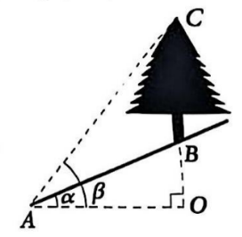
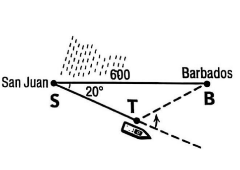
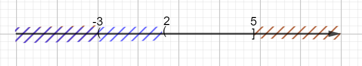
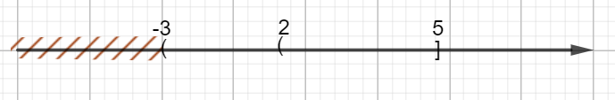
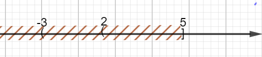
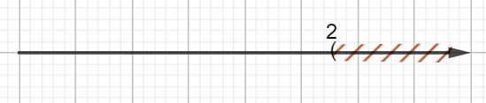
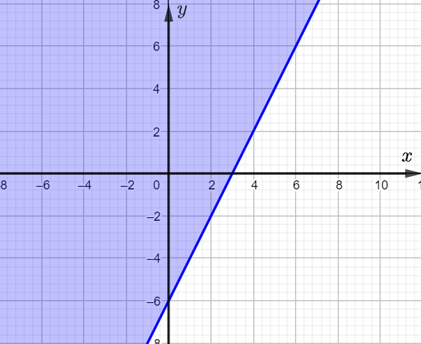

+-----------------------------+----------------------------------------+
| **SỞ GD&ĐT TP HỒ CHÍ MINH** | > **ĐỀ KIỂM TRA GIỮA HỌC KÌ I**        |
|                             | >                                      |
| **TRƯỜNG THPT HỒ THỊ BI**   | > **NĂM HỌC 2025 -- 2026. MÔN: TOÁN    |
|                             | > 10**                                 |
| *(Đề kiểm tra gồm 4 trang)* | >                                      |
|                             | > *(Thời gian làm bài 90 phút, không   |
|                             | > kể thời gian giao đề)*               |
+=============================+========================================+
+-----------------------------+----------------------------------------+

**PHẦN I. CÂU TRẮC NGHIỆM NHIỀU PHƯƠNG ÁN LỰA CHỌN**

Học sinh trả lời từ câu 1 đến câu 16. Mỗi câu hỏi học sinh chỉ chọn một
phương án.

1.  Cho mệnh đề chứa biến . Mệnh đề nào sau đây là đúng?

> **A. \$P\\left( 0 \\right)\$**. **B. \$P\\left( 4 \\right)\$**. **C.
> \$P\\left( 7 \\right)\$**. **D. \$P\\left( 3 \\right)\$**.

2.  Cho tập hợp **\\\[X = \\left\\{ {x;y;z} \\right\\}\\\]**. Tập
    **\\\[X\\\]** có tất cả mấy tập con?

> **A.** 8. **B.** 6. **C.** 7. **D.** 9.

3.  Tập hợp được viết dưới dạng khoảng, đoạn, nửa khoảng là

> **A. \\\[A = \\left\[ { - 5;3} \\right)\\\]**. **B. \\\[A = \\left(
> { - 5;3} \\right)\\\]**. **C.** **\\\[A = \\left\[ { - 5;3}
> \\right\]\\\]**. **D.** **\\\[A = \\left( { - 5;3} \\right\]\\\]**.

4.  Cho tam giác **\\\[ABC\\\]** với **\\\[AB = c,AC = b,BC = a\\\]** và
    **\\\[R\\\]** là bán kính đường tròn ngoại tiếp tam giác
    **\\\[ABC\\\]**. Đẳng thức nào dưới đây **sai**?

> **A. \\\[2R = \\frac{c}{{\\sin C}}\\\]**. **B. \\\[\\frac{b}{{\\sin
> B}} = 2R\\\]**. **C.** **\\\[\\frac{{\\sin B}}{b} = 2R\\\]**. **D.**
> **\\\[\\frac{a}{{\\sin A}} = 2R\\\]**.

5.  Cho tam giác **\\\[ABC\\\]** có **\\\[\\widehat B = 60\^\\circ ,BC =
    8,AB = 5\\\]**. Độ dài cạnh **\\\[AC\\\]** bằng

> **A.** 129. **B.** 49. **C.** 7. **D.** **\\\[\\sqrt {129} \\\]**.

6.  Mệnh đề phủ định của là

> **A.** . **B.** .
>
> **C.** . **D.** .

7.  Giá trị của **\$\\tan 30\^\\circ + \\sin 120\^\\circ \$** bằng

> **A. \\\[ - \\frac{{5\\sqrt 3 }}{6}\\\]**. **B. \\\[\\frac{{\\sqrt 3
> }}{6}\\\]**. **C.** **\\\[ - \\frac{{\\sqrt 3 }}{6}\\\]**. **D.**
> **\\\[\\frac{{5\\sqrt 3 }}{6}\\\]**.

8.  Cho hai tập hợp **\$M = \\left\\{ {2,4,6,9} \\right\\},N = \\left\\{
    {1,2,3,4} \\right\\}\$**. Khi đó

> **A. \$M\\backslash N = \\left\\{ {1,2,3,5} \\right\\}\$**. **B.
> \$M\\backslash N = \\left\\{ 1 \\right\\}\$**.
>
> **C. \$M\\backslash N = \\left\\{ {1,3,6,9} \\right\\}\$**. **D.
> \$M\\backslash N = \\left\\{ {6,9} \\right\\}\$**.

9.  Trong mặt phẳng toạ độ **\$Oxy\$**, trên nửa đường tròn đơn vị, cho
    điểm **\$M\\left( {\\frac{{\\sqrt 3 }}{2};\\frac{1}{2}}
    \\right)\$**. Khi đó, giá trị của **\\\[\\sin \\widehat {xOM}\\\]**
    bằng

> **A. \\\[\\frac{{\\sqrt 3 }}{2}\\\]**. **B. \\\[\\frac{{\\sqrt 3
> }}{3}\\\]**. **C. \\\[\\frac{1}{2}\\\]**. **D. \\\[\\sqrt 3 \\\]**.

10. Cho tập hợp . Viết lại tập hợp **\\\[A\\\]** bằng cách liệt kê các
    phần tử được kết quả là

> **A. \\\[A = \\left\\{ { - 4; - 2} \\right\\}\\\]**. **B. \\\[A =
> \\left\\{ {2;4} \\right\\}\\\]**. **C.** **\\\[A = \\emptyset \\\]**.
> **D.** **\\\[A = \\left\\{ { - 2;4} \\right\\}\\\]**.

11. Trong các câu sau câu nào là mệnh đề chứa biến?

> **A.** 9 là số nguyên tố.
>
> **B.** 18 là số chẵn.
>
> **C.** Hình chữ nhật có hai đường chéo bằng nhau.
>
> **D.** **\\\[\\left( {{x\^2} + x} \\right) \\vdots 3\\\]**.

12. Cho mệnh đề: "Nếu tam giác có hai góc bằng **\\\[60\^\\circ \\\]**
    thì tam giác đó là tam giác đều". Mệnh đề đảo của mệnh đề trên là

> **A.** Một tam giác là tam giác đều nếu và chỉ nếu tam giác đó có hai
> góc bằng **\\\[60\^\\circ \\\]**.
>
> **B.** Nếu tam giác là tam giác đều thì tam giác đó có hai góc bằng
> **\\\[60\^\\circ \\\]**.
>
> **C.** Nếu tam giác có hai góc bằng **\\\[60\^\\circ \\\]** thì tam
> giác đó không phải là tam giác đều.
>
> **D.** Nếu một tam giác là tam giác đều thì tam giác đó có hai góc
> bằng nhau.

13. Trong các phát biểu sau, phát biểu nào là mệnh đề?

> **A.** Một tam giác cân thì mỗi góc đều bằng **\\\[60\^\\circ \\\]**
> phải không?.
>
> **B.** Số 3 là số nguyên tố lẻ nhỏ nhất.
>
> **C.** Đề thi hôm nay khó quá!.
>
> **D.** Các em hãy cố gắng học tập nhé!.

14. Cặp số **\\\[\\left( {1;3} \\right)\\\]** là nghiệm của bất phương
    trình nào sau đây?

> **A. \\\[x - 3y - 2 \< 0\\\]**. **B. \\\[2x - 3y \> 0\\\]**. **C.**
> **\\\[2x - y - 1 \> 0\\\]**. **D.** **\\\[3x - y \< 0\\\]**.

15. Bất phương trình nào sau đây không phải là bất phương trình bậc nhất
    hai ẩn?

> **A. \\\[ - \\frac{x}{2} + \\frac{y}{7} - 2 \> 0\\\]**. **B. \\\[ -
> 4x + 5 \< 0\\\]**. **C.** **\\\[2x - y - 4 \\ge 0\\\]**. **D.**
> **\\\[\\frac{1}{x} + \\frac{3}{y} - 5 \\le 0\\\]**.

16. Cho hai tập hợp **\\\[A = \\left( {1;5} \\right),B = \\left\[ {0;3}
    \\right\]\\\]**. Khi đó

> **A. \\\[A \\cup B = \\left\[ {3;5} \\right)\\\]**. **B. \\\[A \\cup B
> = \\left\[ {0;5} \\right)\\\]**. **C.** **\\\[A \\cup B = \\left\[
> {0;1} \\right)\\\]**. **D.** **\\\[A \\cup B = \\left( {1;3}
> \\right\]\\\]**.

**PHẦN II. CÂU TRẮC NGHIỆM ĐÚNG SAI**

Học sinh trả lời từ câu 1 đến câu 2. Trong mỗi ý a), b), c), d) ở mỗi
câu, học sinh chọn đúng hoặc sai.

1.  Cho tam giác **\$ABC\$** biết **\$BC = 4,\\,AC = 6,\\,\\widehat
    {ACB} = 60\^\\circ \$**. Khi đó

> a\) **\$AB = 2\\sqrt 7 \$**.
>
> b\) Độ dài đường cao tương ứng với cạnh **\$BC\$** là **\${h_a} =
> 2\\sqrt 3 \$**.
>
> c\) Diện tích tam giác**\$ABC\$** bằng 6.
>
> d\) Bán kính đường tròn nội tiếp tam giác **\$ABC\$** là **\$r =
> \\frac{{2\\sqrt {21} }}{3}\$**.

2.  Lớp 10A có 28 học sinh tham gia câu lạc bộ thể thao, 19 học sinh
    tham gia câu lạc bộ âm nhạc, 10 học sinh tham gia cả hai câu lạc bộ
    này. Gọi **\$A\$** là tập hợp các học sinh của lớp 10A tham gia câu
    lạc bộ thể thao, **\$B\$** là tập hợp các học sinh của lớp 10A tham
    gia câu lạc bộ âm nhạc

> a\) **\$n\\left( A \\right) = 19\$**.
>
> b\) Số học sinh của lớp 10A tham gia ít nhất một trong hai câu lạc bộ
> này là 37 học sinh.
>
> c\) Số học sinh của lớp 10A tham gia câu lạc bộ thể thao và không tham
> gia câu lạc bộ âm nhạc là 9 học sinh.
>
> d\) **\$n\\left( {A \\cap B} \\right) = 10\$**.

**PHẦN III. TỰ LUẬN**

Học sinh trình bày lời giải từ câu 1 đến câu 4.

1.  Cho hai tập hợp **\\\[A = \\left( { - 3\\,;\\,5} \\right\]\\\]** và
    **\\\[B = \\left( {2\\,;\\, + \\infty } \\right)\\\]**. Hãy xác định
    các tập hợp: .

2.  Biểu diễn miền nghiệm của bất phương trình **\\\[2x - y \\ge 6\\\]**
    trên mặt phẳng tọa độ.

3.  Trên sườn đồi nghiêng một góc **\\\[\\alpha = \\widehat {OAB} =
    26\^\\circ \\\]** so với phương nằm ngang, có một cây cồ thụ mọc
    thẳng đứng (hình minh họa bên dưới). Từ điểm **\\\[A\\\]** dưới chân
    đồi, cách gốc cây một đoạn **\\\[AB = 30m\\\]**, người ta nhìn đỉnh
    ngọn cây **\\\[C\\\]** dưới một góc **\\\[\\beta = \\widehat {OAC} =
    50\^\\circ \\\]** so với phương nằm ngang. Tính chiều cao
    **\\\[BC\\\]** của cây cổ thụ (*kết quả làm tròn đến hàng đơn vị,
    đơn vị tính bằng mét).*

{width="2.8337292213473315in"
height="2.771220472440945in"}

4.  Một tàu du lịch chạy với tốc độ trung bình 15 hải lý/giờ khi đi từ
    San Juan, Puerto Rico, đến Barbados, Tây Ấn Độ, với khoảng cách 600
    hải lý. Để tránh một cơn bão nhiệt đới, thuyền trưởng cho tàu rời
    San Juan theo hướng lệch một góc **\\\[20\^\\circ \\\]** so với
    hướng đi thẳng đến Barbados (hình minh họa bên dưới). Thuyền trưởng
    duy trì tốc độ 15 hải lý/giờ trong 10 giờ, sau đó thuyền trưởng cho
    tàu đổi hướng tại **\\\[T\\\]** để đi thẳng đến Barbados mà không
    gặp bão. Tính từ vị trí **\\\[T\\\]**, con tàu còn cách Barbados bao
    nhiêu hải lý? *(kết quả làm tròn đến hàng đơn vị)*

> {width="2.5123928258967627in"
> height="1.7804779090113736in"}

🙢 **HẾT** 🙠

+-----------------------------+----------------------------------------+
| **SỞ GD&ĐT TP HỒ CHÍ MINH** | > **ĐỀ KIỂM TRA GIỮA HỌC KÌ I**        |
|                             | >                                      |
| **TRƯỜNG THPT HỒ THỊ BI**   | > **NĂM HỌC 2025 -- 2026. MÔN: TOÁN    |
|                             | > 10**                                 |
| *(Đáp án gồm 8 trang)*      | >                                      |
|                             | > *(Thời gian làm bài 90 phút, không   |
|                             | > kể thời gian giao đề)*               |
+=============================+========================================+
+-----------------------------+----------------------------------------+

**PHẦN I. CÂU TRẮC NGHIỆM NHIỀU PHƯƠNG ÁN LỰA CHỌN**

**BẢNG ĐÁP ÁN**

  ----------------------------------------------------------------------------------------------------------
  **1.C**    **2.A**    **3.A**    **4.C**    **5.C**    **6.A**    **7.D**   **8.D**   **9.A**   **10.B**
  ---------- ---------- ---------- ---------- ---------- ---------- --------- --------- --------- ----------
  **11.D**   **12.B**   **13.B**   **14.A**   **15.D**   **16.B**                                 

  ----------------------------------------------------------------------------------------------------------

**HƯỚNG DẪN GIẢI CHI TIẾT**

1.  Cho mệnh đề chứa biến . Mệnh đề nào sau đây là đúng?

> **A. \$P\\left( 0 \\right)\$**. **B. \$P\\left( 4 \\right)\$**.
> **[C]{.underline}. \$P\\left( 7 \\right)\$**. **D. \$P\\left( 3
> \\right)\$**.
>
> **Lời giải**
>
> **[Chọn C]{.mark}**
>
> ⮚ Xét phương án **\$A\$**. Vì là sai. Suy ra phương án **\$A\$** sai.
>
> ⮚ Xét phương án **\$B\$**. Vì là sai. Suy ra phương án **\$B\$** sai.
>
> ⮚ Xét phương án **\$C\$**. Vì là đúng. Suy ra phương án **\$C\$**
> đúng.
>
> ⮚ Xét phương án **\$D\$**. Vì là sai. Suy ra phương án **\$D\$** sai.

2.  Cho tập hợp **\\\[X = \\left\\{ {x;y;z} \\right\\}\\\]**. Tập
    **\\\[X\\\]** có tất cả mấy tập con?

> **[A]{.underline}.** 8. **B.** 6. **C.** 7. **D.** 9.
>
> **Lời giải**
>
> **[Chọn A]{.mark}**
>
> Tập **\\\[X\\\]** có các tập con là **\\\[\\emptyset ,\\left\\{ x
> \\right\\},\\left\\{ y \\right\\},\\left\\{ z \\right\\},\\left\\{
> {x,y} \\right\\},\\left\\{ {x,z} \\right\\},\\left\\{ {y,z}
> \\right\\},\\left\\{ {x,y,z} \\right\\}\\\]**.
>
> Tập **\\\[X\\\]** có 8 tập con.

3.  Tập hợp được viết dưới dạng khoảng, đoạn, nửa khoảng là

> **[A]{.underline}. \\\[A = \\left\[ { - 5;3} \\right)\\\]**. **B.
> \\\[A = \\left( { - 5;3} \\right)\\\]**. **C.** **\\\[A = \\left\[ { -
> 5;3} \\right\]\\\]**. **D.** **\\\[A = \\left( { - 5;3}
> \\right\]\\\]**.
>
> **Lời giải**
>
> **[Chọn A]{.mark}**
>
> .

4.  Cho tam giác **\\\[ABC\\\]** với **\\\[AB = c,AC = b,BC = a\\\]** và
    **\\\[R\\\]** là bán kính đường tròn ngoại tiếp tam giác
    **\\\[ABC\\\]**. Đẳng thức nào dưới đây **sai**?

> **A. \\\[2R = \\frac{c}{{\\sin C}}\\\]**. **B. \\\[\\frac{b}{{\\sin
> B}} = 2R\\\]**. **[C]{.underline}.** **\\\[\\frac{{\\sin B}}{b} =
> 2R\\\]**. **D.** **\\\[\\frac{a}{{\\sin A}} = 2R\\\]**.
>
> **Lời giải**
>
> **[Chọn C]{.mark}**
>
> Theo định lý sin, ta có: **\\\[2R = \\frac{a}{{\\sin A}} =
> \\frac{b}{{\\sin B}} = \\frac{c}{{\\sin C}}\\\]**. Vậy nên đáp án
> **\\\[A,B,D\\\]** đúng, đáp án **\\\[C\\\]** sai.

5.  Cho tam giác **\\\[ABC\\\]** có **\\\[\\widehat B = 60\^\\circ ,BC =
    8,AB = 5\\\]**. Độ dài cạnh **\\\[AC\\\]** bằng

> **A.** 129. **B.** 49. **[C]{.underline}.** 7. **D.** **\\\[\\sqrt
> {129} \\\]**.
>
> **Lời giải**
>
> **[Chọn C]{.mark}**
>
> Theo định lý Côsin, ta có: **\\\[A{C\^2} = A{B\^2} + B{C\^2} -
> 2.AB.BC.\\cos B = 25 + 64 - 2.5.8.\\cos 60\^\\circ = 49\\\]**.
>
> **\\\[ \\Rightarrow AC = 7\\\]**.

6.  Mệnh đề phủ định của là

> **[A]{.underline}.** . **B.** .
>
> **C.** . **D.** .
>
> **Lời giải**
>
> **[Chọn A]{.mark}**
>
> Mệnh đề phủ định của là .

7.  Giá trị của **\$\\tan 30\^\\circ + \\sin 120\^\\circ \$** bằng

> **A. \\\[ - \\frac{{5\\sqrt 3 }}{6}\\\]**. **B. \\\[\\frac{{\\sqrt 3
> }}{6}\\\]**. **C.** **\\\[ - \\frac{{\\sqrt 3 }}{6}\\\]**.
> **[D]{.underline}.** **\\\[\\frac{{5\\sqrt 3 }}{6}\\\]**.
>
> **Lời giải**
>
> **[Chọn D]{.mark}**
>
> **\$\\tan 30\^\\circ + \\sin 120\^\\circ = \\frac{{\\sqrt 3 }}{3} +
> \\frac{{\\sqrt 3 }}{2} = \\frac{{5\\sqrt 3 }}{6}\$**.

8.  Cho hai tập hợp **\$M = \\left\\{ {2,4,6,9} \\right\\},N = \\left\\{
    {1,2,3,4} \\right\\}\$**. Khi đó

> **A. \$M\\backslash N = \\left\\{ {1,2,3,5} \\right\\}\$**. **B.
> \$M\\backslash N = \\left\\{ 1 \\right\\}\$**.
>
> **C. \$M\\backslash N = \\left\\{ {1,3,6,9} \\right\\}\$**.
> **[D]{.underline}. \$M\\backslash N = \\left\\{ {6,9} \\right\\}\$**.
>
> **Lời giải**
>
> **[Chọn D]{.mark}**
>
> **\$M\\backslash N = \\left\\{ {6,9} \\right\\}\$**.

9.  Trong mặt phẳng toạ độ **\$Oxy\$**, trên nửa đường tròn đơn vị, cho
    điểm **\$M\\left( {\\frac{{\\sqrt 3 }}{2};\\frac{1}{2}}
    \\right)\$**. Khi đó, giá trị của **\\\[\\sin \\widehat {xOM}\\\]**
    bằng

> **[A]{.underline}. \\\[\\frac{{\\sqrt 3 }}{2}\\\]**. **B.
> \\\[\\frac{{\\sqrt 3 }}{3}\\\]**. **C. \\\[\\frac{1}{2}\\\]**. **D.
> \\\[\\sqrt 3 \\\]**.
>
> **Lời giải**
>
> **[Chọn A]{.mark}**
>
> Giá trị của **\\\[\\sin \\widehat {xOM}\\\]** bằng
> **\\\[\\frac{{\\sqrt 3 }}{2}\\\]**.

10. Cho tập hợp . Viết lại tập hợp **\\\[A\\\]** bằng cách liệt kê các
    phần tử được kết quả là

> **A. \\\[A = \\left\\{ { - 4; - 2} \\right\\}\\\]**.
> **[B]{.underline}. \\\[A = \\left\\{ {2;4} \\right\\}\\\]**. **C.**
> **\\\[A = \\emptyset \\\]**. **D.** **\\\[A = \\left\\{ { - 2;4}
> \\right\\}\\\]**.
>
> **Lời giải**
>
> **[Chọn B]{.mark}**
>
> Ta có: **\\\[{x\^2} - 6x + 8 = 0 \\Leftrightarrow \\left\[
> \\begin{array}{l}**
>
> **x = 2\\\\**
>
> **x = 4**
>
> **\\end{array} \\right.\\\]** **\\\[ \\Rightarrow A = \\left\\{ {2;4}
> \\right\\}\\\]**.

11. Trong các câu sau câu nào là mệnh đề chứa biến?

> **A.** 9 là số nguyên tố.
>
> **B.** 18 là số chẵn.
>
> **C.** Hình chữ nhật có hai đường chéo bằng nhau.
>
> **[D]{.underline}.** **\\\[\\left( {{x\^2} + x} \\right) \\vdots
> 3\\\]**.
>
> **Lời giải**
>
> **[Chọn D]{.mark}**
>
> **\\\[\\left( {{x\^2} + x} \\right) \\vdots 3\\\]** là mệnh đề chứa
> biến.

12. Cho mệnh đề: "Nếu tam giác có hai góc bằng **\\\[60\^\\circ \\\]**
    thì tam giác đó là tam giác đều". Mệnh đề đảo của mệnh đề trên là

> **A.** Một tam giác là tam giác đều nếu và chỉ nếu tam giác đó có hai
> góc bằng **\\\[60\^\\circ \\\]**.
>
> **[B]{.underline}.** Nếu tam giác là tam giác đều thì tam giác đó có
> hai góc bằng **\\\[60\^\\circ \\\]**.
>
> **C.** Nếu tam giác có hai góc bằng **\\\[60\^\\circ \\\]** thì tam
> giác đó không phải là tam giác đều.
>
> **D.** Nếu một tam giác là tam giác đều thì tam giác đó có hai góc
> bằng nhau.
>
> **Lời giải**
>
> **[Chọn B]{.mark}**
>
> Mệnh đề đảo là "Nếu tam giác là tam giác đều thì tam giác đó có hai
> góc bằng **\\\[60\^\\circ \\\]**".

13. Trong các phát biểu sau, phát biểu nào là mệnh đề?

> **A.** Một tam giác cân thì mỗi góc đều bằng **\\\[60\^\\circ \\\]**
> phải không?.
>
> **[B]{.underline}.** Số 3 là số nguyên tố lẻ nhỏ nhất.
>
> **C.** Đề thi hôm nay khó quá!.
>
> **D.** Các em hãy cố gắng học tập nhé!.
>
> **Lời giải**
>
> **[Chọn B]{.mark}**
>
> Phát biểu "Số 3 là số nguyên tố lẻ nhỏ nhất" là mệnh đề.

14. Cặp số **\\\[\\left( {1;3} \\right)\\\]** là nghiệm của bất phương
    trình nào sau đây?

> **[A]{.underline}. \\\[x - 3y - 2 \< 0\\\]**. **B. \\\[2x - 3y \>
> 0\\\]**. **C.** **\\\[2x - y - 1 \> 0\\\]**. **D.** **\\\[3x - y \<
> 0\\\]**.
>
> **Lời giải**
>
> **[Chọn A]{.mark}**
>
> Cặp số **\\\[\\left( {1;3} \\right)\\\]** là nghiệm của bất phương
> trình **\\\[x - 3y - 2 \< 0\\\]** vì **\\\[1 - 3.3 - 2 = - 10 \<
> 0\\\]**.

15. Bất phương trình nào sau đây không phải là bất phương trình bậc nhất
    hai ẩn?

> **A. \\\[ - \\frac{x}{2} + \\frac{y}{7} - 2 \> 0\\\]**. **B. \\\[ -
> 4x + 5 \< 0\\\]**. **C.** **\\\[2x - y - 4 \\ge 0\\\]**.
> **[D]{.underline}.** **\\\[\\frac{1}{x} + \\frac{3}{y} - 5 \\le
> 0\\\]**.
>
> **Lời giải**
>
> **[Chọn D]{.mark}**
>
> **\\\[\\frac{1}{x} + \\frac{3}{y} - 5 \\le 0\\\]** không là bất phương
> trình bậc nhất 2 ẩn.

16. Cho hai tập hợp **\\\[A = \\left( {1;5} \\right),B = \\left\[ {0;3}
    \\right\]\\\]**. Khi đó

> **A. \\\[A \\cup B = \\left\[ {3;5} \\right)\\\]**. **[B]{.underline}.
> \\\[A \\cup B = \\left\[ {0;5} \\right)\\\]**. **C.** **\\\[A \\cup B
> = \\left\[ {0;1} \\right)\\\]**. **D.** **\\\[A \\cup B = \\left(
> {1;3} \\right\]\\\]**.
>
> **Lời giải**
>
> **[Chọn B]{.mark}**
>
> **\\\[A \\cup B = \\left\[ {0;5} \\right)\\\]**.

**PHẦN II. CÂU TRẮC NGHIỆM ĐÚNG SAI**

**BẢNG ĐÁP ÁN**

  -----------------------------------------------------------------------
  **Câu 1**                           **Câu 2**
  ----------------------------------- -----------------------------------
  a\) Đ                               a\) S

  b\) S                               b\) Đ

  c\) S                               c\) S

  d\) S                               d\) Đ
  -----------------------------------------------------------------------

**HƯỚNG DẪN GIẢI CHI TIẾT**

1.  Cho tam giác **\$ABC\$** biết **\$BC = 4,\\,AC = 6,\\,\\widehat
    {ACB} = 60\^\\circ \$**. Khi đó

> [a]{.underline}) **\$AB = 2\\sqrt 7 \$**.
>
> b\) Độ dài đường cao tương ứng với cạnh **\$BC\$** là **\${h_a} =
> 2\\sqrt 3 \$**.
>
> c\) Diện tích tam giác**\$ABC\$** bằng 6.
>
> d\) Bán kính đường tròn nội tiếp tam giác **\$ABC\$** là **\$r =
> \\frac{{2\\sqrt {21} }}{3}\$**.
>
> **Lời giải**
>
> a\) Đúng.
>
> Xét tam giác **\$ABC\$**, ta có **\$A{B\^2} = C{B\^2} + C{A\^2} -
> 2CB.CA.cos\\widehat {ACB} = 16 + 36 - 2.4.6.cos60\^\\circ = 28\$**
>
> Suy ra **\$AB = 2\\sqrt 7 \$**.
>
> b\) Sai.
>
> Xét tam giác **\$ABC\$**, ta có **\${h_a} = AC.\\sin 60\^\\circ =
> 6.\\sin 60\^\\circ .3\\sqrt 3 \$**.
>
> c\) Sai
>
> Diện tích tam giác **\$ABC\$** là **\$S = \\frac{1}{2}a.{h_a} =
> \\frac{1}{2}.4.3\\sqrt 3 = 6\\sqrt 3 \$**.
>
> d\) Sai
>
> Bán kính đường tròn nội tiếp tam giác **\$ABC\$** là **\$r =
> \\frac{S}{p} = \\frac{{2S}}{{a + b + c}} = \\frac{{12\\sqrt 3 }}{{4 +
> 6 + 2\\sqrt 7 }} = \\frac{{12\\sqrt 3 }}{{10 + 2\\sqrt 7 }}\$**.

2.  Lớp 10A có 28 học sinh tham gia câu lạc bộ thể thao, 19 học sinh
    tham gia câu lạc bộ âm nhạc, 10 học sinh tham gia cả hai câu lạc bộ
    này. Gọi **\$A\$** là tập hợp các học sinh của lớp 10A tham gia câu
    lạc bộ thể thao, **\$B\$** là tập hợp các học sinh của lớp 10A tham
    gia câu lạc bộ âm nhạc

> a\) **\$n\\left( A \\right) = 19\$**.
>
> [b]{.underline}) Số học sinh của lớp 10A tham gia ít nhất một trong
> hai câu lạc bộ này là 37 học sinh.
>
> c\) Số học sinh của lớp 10A tham gia câu lạc bộ thể thao và không tham
> gia câu lạc bộ âm nhạc là 9 học sinh.
>
> [d]{.underline}) **\$n\\left( {A \\cap B} \\right) = 10\$**.
>
> **Lời giải**
>
> a\) Sai.
>
> Vì lớp 10A có 28 học sinh tham gia câu lạc bộ thể thao nên
> **\$n\\left( A \\right) = 28\$**.
>
> [b]{.underline}) Đúng
>
> Số học sinh của lớp 10A tham gia ít nhất một trong hai câu lạc bộ này
> là:
>
> **\$n\\left( {A \\cup B} \\right) = n\\left( A \\right) + n\\left( B
> \\right) - n\\left( {A \\cap B} \\right) = 28 + 19 - 10 = 37\$**.
>
> c\) Sai
>
> Số học sinh của lớp 10A tham gia câu lạc bộ thể thao và không tham gia
> câu lạc bộ âm nhạc là:
>
> **\$n\\left( {A\\backslash \\left( {A \\cap B} \\right)} \\right) =
> 28 - 10 = 18\$**.
>
> [d]{.underline}) Đúng
>
> Vì có 10 học sinh tham gia cả hai câu lạc bộ, nên **\$n\\left( {A
> \\cap B} \\right) = 10\$**.

**PHẦN III. TỰ LUẬN**

**HƯỚNG DẪN GIẢI CHI TIẾT**

1.  Cho hai tập hợp **\\\[A = \\left( { - 3\\,;\\,5} \\right\]\\\]** và
    **\\\[B = \\left( {2\\,;\\, + \\infty } \\right)\\\]**. Hãy xác định
    các tập hợp: .

> **Lời giải**
>
> {width="4.484003718285214in"
> height="0.8231146106736658in"}
>
> **\\\[A \\cap B = \\left( {2\\,;\\,5} \\right\]\\\].**
>
> {width="4.295451662292214in"
> height="0.7044794400699913in"}
>
> **\\\[A \\cup B = \\left( { - 3\\,;\\, + \\infty } \\right)\\\].**
>
> {width="4.249516622922135in"
> height="0.9280555555555555in"}
>
> **\\\[B\\backslash A = \\left( {5\\,;\\, + \\infty } \\right)\\\].**
>
> {width="4.275369641294838in"
> height="0.9111450131233596in"}
>
> **.**

2.  Biểu diễn miền nghiệm của bất phương trình **\\\[2x - y \\ge 6\\\]**
    trên mặt phẳng tọa độ.

> **Lời giải**
>
> Vẽ đường thẳng **\\\[d:2x - y = 6\\\]**
>
> Lấy điểm **\\\[O\\left( {0\\,;\\,0} \\right) \\notin d\\\]**
>
> Ta có: **\\\[2.0 - 0 \\ge 6\\\]** là mệnh đề sai.
>
> Vậy miền nghiệm của bất phương trình đã cho là nửa mặt phẳng bờ
> **\\\[d\\\]**, không chứa điểm **\\\[O\\left( {0\\,;\\,0}
> \\right)\\\]**, kể cả bờ **\\\[d\\\]** (Miền không tô màu trong hình
> vẽ dưới đây).
>
> {width="4.639312117235345in"
> height="3.7881332020997376in"}

3.  Trên sườn đồi nghiêng một góc **\\\[\\alpha = \\widehat {OAB} =
    26\^\\circ \\\]** so với phương nằm ngang, có một cây cồ thụ mọc
    thẳng đứng (hình minh họa bên dưới). Từ điểm **\\\[A\\\]** dưới chân
    đồi, cách gốc cây một đoạn **\\\[AB = 30m\\\]**, người ta nhìn đỉnh
    ngọn cây **\\\[C\\\]** dưới một góc **\\\[\\beta = \\widehat {OAC} =
    50\^\\circ \\\]** so với phương nằm ngang. Tính chiều cao
    **\\\[BC\\\]** của cây cổ thụ (*kết quả làm tròn đến hàng đơn vị,
    đơn vị tính bằng mét).*

{width="2.8337292213473315in"
height="2.771220472440945in"}

> **Lời giải**
>
> Ta có:
>
> **\\\[\\widehat {BAC} = \\widehat {OAC} - \\widehat {OAB} =
> 50\^\\circ - 26\^\\circ = 24\^\\circ \\\]**,
>
> **\\\[\\widehat {OCA} = 90\^\\circ - \\widehat {OAC} = 90\^\\circ -
> 50\^\\circ = 40\^\\circ \\\]**.
>
> Áp dụng định lí Sin trong tam giác **\\\[ABC\\\]**, ta có:
>
> **\\\[\\frac{{BC}}{{\\sin \\widehat {BAC}}} = \\frac{{AB}}{{\\sin
> \\widehat {OCA}}} \\Rightarrow BC = \\frac{{AB.\\sin \\widehat
> {BAC}}}{{\\sin \\widehat {OCA}}} = \\frac{{30.\\sin 24\^\\circ
> }}{{\\sin 40\^\\circ }} \\approx 19m\\\]**.
>
> Vậy chiều cao của cây cổ thụ là khoảng 19 mét.

4.  Một tàu du lịch chạy với tốc độ trung bình 15 hải lý/giờ khi đi từ
    San Juan, Puerto Rico, đến Barbados, Tây Ấn Độ, với khoảng cách 600
    hải lý. Để tránh một cơn bão nhiệt đới, thuyền trưởng cho tàu rời
    San Juan theo hướng lệch một góc **\\\[20\^\\circ \\\]** so với
    hướng đi thẳng đến Barbados (hình minh họa bên dưới). Thuyền trưởng
    duy trì tốc độ 15 hải lý/giờ trong 10 giờ, sau đó thuyền trưởng cho
    tàu đổi hướng tại **\\\[T\\\]** để đi thẳng đến Barbados mà không
    gặp bão. Tính từ vị trí **\\\[T\\\]**, con tàu còn cách Barbados bao
    nhiêu hải lý? *(kết quả làm tròn đến hàng đơn vị)*

> {width="2.5123928258967627in"
> height="1.7804779090113736in"}
>
> **Lời giải**
>
> Quãng đường **\\\[ST\\\]** mà tàu đi được là: **\\\[ST = 15.10 =
> 150\\\]** hải lý.
>
> Áp dụng định lí Cosin trong tam giác **\\\[STB\\\]** ta được: **\\\[TB
> = \\sqrt {S{T\^2} + S{B\^2} - 2.ST.SB.\\cos S} = \\sqrt {{{150}\^2} +
> {{600}\^2} - 2.150.600.\\cos 20\^\\circ } \\approx 462\\\]** (hải lý).
>
> Vậy tính từ vị trí **\\\[T\\\]**, con tàu còn cách Barbados khoảng 462
> hải lý.

🙢 **HẾT** 🙠
